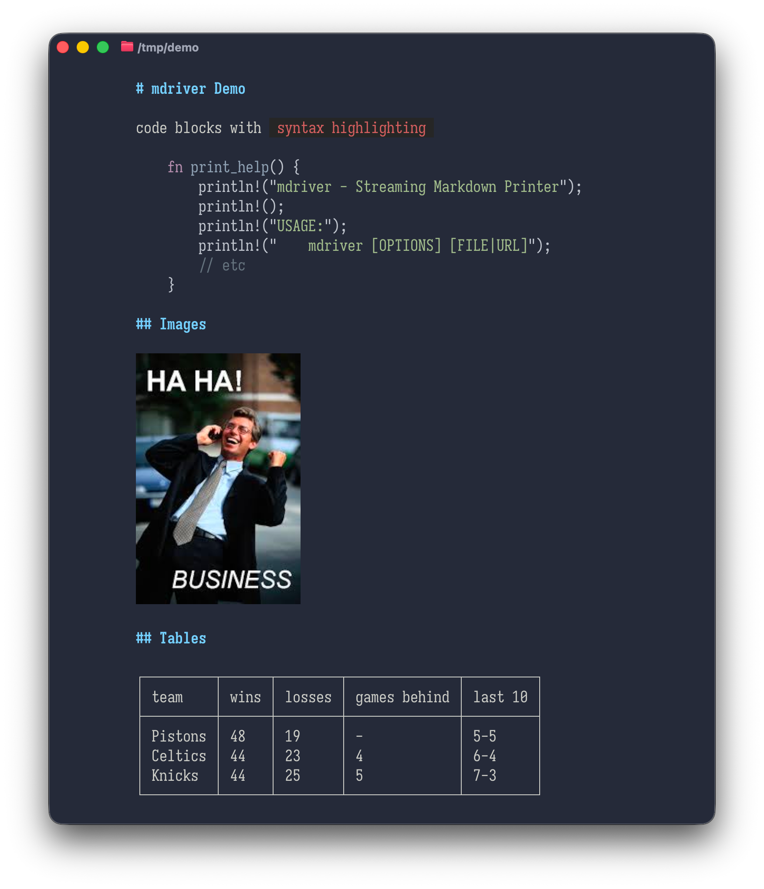

# mdriver

[](https://github.com/llimllib/mdriver/actions/workflows/ci.yml)
[](https://crates.io/crates/mdriver)

A fast, beautiful, streaming markdown renderer for the terminal that prints markdown and uses the facilities of modern terminals to make it as interactive as possible.



## Features

### Streaming output

`mdriver` prints markdown as it arrives, rather than waiting for the document to complete before printing it.

Pipe your llm output through it, or a markdown file from the web, and it will display it as soon as it can.

### Beautiful display

`mdriver` strives to present attractive, colorful output in the terminal

### Modern terminal features

`mdriver` will:

- display images referenced in markdown in your terminal that supports the kitty protocol (kitty, ghostty, alacritty, and others)
- syntax-highlight fenced code blocks for many languages using [syntect](https://github.com/trishume/syntect)
- render [mermaid diagrams](https://docs.github.com/en/get-started/writing-on-github/working-with-advanced-formatting/creating-diagrams) into images and display them in your terminal
- parse a subset of HTML and display it sensibly in the terminal
- accept input from stdin, files, or URLs
- Use [OSC8 hyperlinks](https://gist.github.com/egmontkob/eb114294efbcd5adb1944c9f3cb5feda) to make links clickable

## Installation

### Using Homebrew (macOS)

```bash
brew install llimllib/tap/mdriver
```

### From crates.io

```bash
cargo install mdriver
```

### From Pre-built Binaries

Download the latest release for your platform from the [GitHub Releases](https://github.com/llimllib/mdriver/releases) page:

- **Linux**: `mdriver-x86_64-unknown-linux-gnu.tar.gz`
- **macOS**: `mdriver-x86_64-apple-darwin.tar.gz` (Intel) or `mdriver-aarch64-apple-darwin.tar.gz` (Apple Silicon)

(want windows? [help me out](https://github.com/llimllib/mdriver/issues/60))

Extract `mdriver` and add it to your PATH:

```bash
tar xzf mdriver-*.tar.gz
sudo mv mdriver /usr/local/bin/
```

### From Source

```bash
git clone https://github.com/llimllib/mdriver.git
cd mdriver
cargo build --release
```

The binary will be available at `target/release/mdriver`.

## Usage

```bash
# Read from file
mdriver README.md

# Pipe markdown from a file
cat document.md | mdriver

# Pipe from echo
echo "# Hello World" | mdriver

# Redirect from file
mdriver < document.md

# Use a specific syntax highlighting theme
mdriver --theme "InspiredGitHub" README.md

# Set default theme via environment variable
MDRIVER_THEME="Solarized (dark)" mdriver README.md

# List available themes
mdriver --list-themes

# Render images using kitty graphics protocol
mdriver --images kitty document.md

# Control color output (auto, always, never)
mdriver --color=always README.md | less -R

# Show help
mdriver --help
```

## Syntax Highlighting Themes

mdriver uses the [syntect](https://github.com/trishume/syntect) library for syntax highlighting, supporting 100+ languages with customizable color themes.

### Available Themes

Use `mdriver --list-themes` to see all available themes. Popular options include:

- **InspiredGitHub** - Bright, vibrant colors inspired by GitHub's syntax highlighting
- **Solarized (dark)** - The classic Solarized dark color scheme
- **Solarized (light)** - Solarized optimized for light backgrounds
- **base16-ocean.dark** - Calm oceanic colors (default)
- **base16-mocha.dark** - Warm mocha tones
- **base16-eighties.dark** - Retro 80s aesthetic

### Setting a Theme

There are three ways to configure the theme (in order of precedence):

1. **Command-line flag**: `mdriver --theme "InspiredGitHub" file.md`
2. **Environment variable**: `export MDRIVER_THEME="Solarized (dark)"`
3. **Default**: `base16-ocean.dark`

### Example

```bash
# Use InspiredGitHub theme
mdriver --theme "InspiredGitHub" README.md

# Set environment variable for persistent default
export MDRIVER_THEME="Solarized (dark)"
mdriver README.md

# Combine with piping
MDRIVER_THEME="base16-mocha.dark" cat file.md | mdriver
```

## Image Rendering

mdriver can render images inline in your terminal using the [kitty graphics protocol](https://sw.kovidgoyal.net/kitty/graphics-protocol/). This feature works with any terminal that supports the kitty graphics protocol (kitty, WezTerm, Ghostty, etc.).

In terminals without image support, images will display as alt text.

Use the `--images kitty` flag to enable image display:

```bash
# Render local images
mdriver --images kitty document.md

# Works with remote URLs
echo "" | mdriver --images kitty

# Combine with theme selection
mdriver --theme "InspiredGitHub" --images kitty README.md
```

### Image Features

- **Auto-resize**: Images automatically resize to fit terminal width while preserving aspect ratio
- **Remote URLs**: Fetches and displays images from HTTP/HTTPS URLs
- **Graceful fallback**: Shows alt text when image fails to load
- **Backward compatible**: Without `--images` flag, images render as plain text ``
- **Extensible**: Architecture supports future protocols (sixel, iTerm2, etc.)

## Color Output Control

By default, mdriver automatically detects whether to use ANSI colors based on whether stdout is a terminal. You can override this behavior with the `--color` flag.

### Color Modes

| Mode     | Description                                         |
| -------- | --------------------------------------------------- |
| `auto`   | Use colors only when stdout is a terminal (default) |
| `always` | Always emit ANSI color codes, even when piping      |
| `never`  | Never use colors                                    |

## Development

This code is written almost entirely by an LLM. It started as an experiment in
LLM-driven usage and I've found it to be successful so far; I use mdriver every
day and it's been very useful to me.

I can read rust, but I don't really have aesthetic opinions on it; I chose to
build this in rust for that reason. Quality is mainly enforced by a thorough
test suite and static checks, as well as my own opinions about how CLI programs
ought to behave.

I care about binary size, and have disabled as many features from imported
libraries as possible, and avoided libraries where possible, with the proviso
that this is intended to be a featureful application rather than a minimal one.
As of this writing it is 8.1mb.

### Static checks & tests

See [docs/conformance.md](docs/conformance.md) for details on the test suite

```bash
# All must pass before committing:
cargo fmt                                                # Format code
cargo build                                              # No warnings
cargo build --release                                    # No warnings
cargo clippy --all-targets --all-features -- -D warnings # No errors
cargo test                                               # All tests pass
```

See `CLAUDE.md` for comprehensive development guidelines and best practices.

### Contributing

1. Fork the repository
2. Create a feature branch
3. Write tests first
4. Implement feature to pass tests
5. Ensure all quality checks pass
6. Submit pull request

## License

MIT
